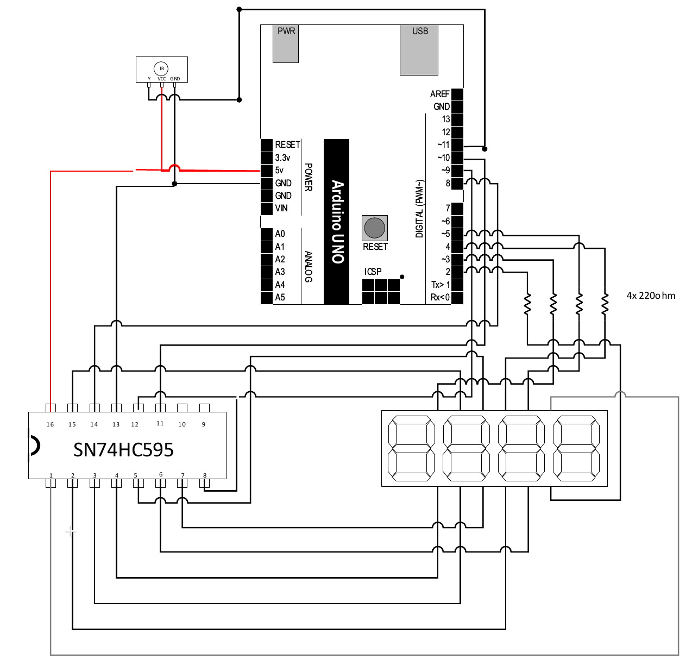

# lafvin-bitadd

A 4-bit adder/subtractor w/ Arduino Uno board from a Lafvin kit. Made as extra credit for a class.

Takes input via IR remote and performs calculation using binary addition and subtraction.

## IR remote

The IR remote has a numerical keypad. Entry of numbers must be down by pressing 0 or 1, all other numbers do not function. Decimal entry is not accepted. You are able to input up to 4 digits. Once a group is completed, the display will briefly flicker with the final result, then reset back to all zeroes, indicating that you must enter the input for the next group.

Input accepted through the remote is often unreliable due to the cheap reciever included in the kit. If the display suddenly dims, the board is stuck in an infinite loop and the reset button must be pressed. You can avoid this by using the remote at a distance greater than 6 feet.

After you are done entering the values in for A and B, you select UP for addition, and DOWN for subtraction. After this, the result is displayed.

## Displaying results

Due to the lack of components, the fifth bit gets displayed by alternating between the 4th and last digit. To obtain the actual result, get the value that is displayed when there is only one digit is showing. This is your furthest left digit. After it alternates back to show all four, append this value from the first digit obtained. This is your final answer.

## Logic

The program does use binary addition and subtraction logic. It does not convert number back to decimal to cheat its way through. 'A', 'B', and the solution gets stored in an array. Addition is done via division and remainder to obtain the carry amount. Subtraction is done using two's complement with 0x1 incremented, then regular addition rules. Subtraction has some logic to remove the carry at the beginning, although it isn't perfect and has some edge cases.

## Schematic

## Issues

* Subtraction might be incorrect since the solution to ignore the leftover carry was to set the last digit to 1. Needs proper implementation.

## Video

TBA
